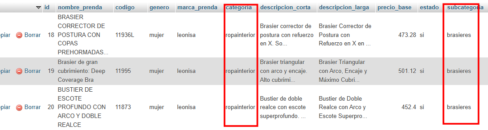
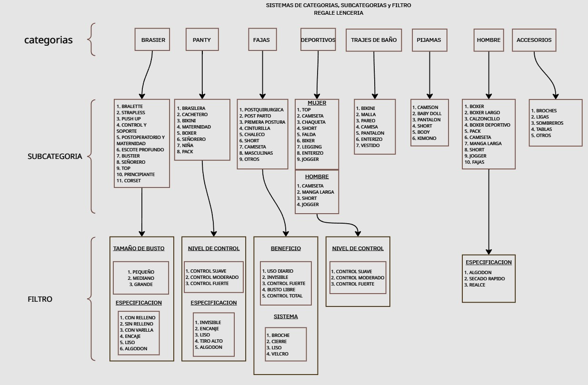
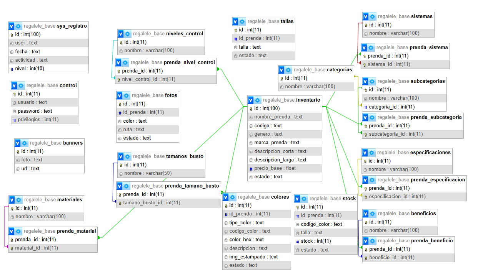

# regalelenceria-project


## Cambios en la estructura de la base datos

Se separaron las categorias y subcategorias dentro de la tabla inventario 
pasando hacer tablas independientes, esto para hacer la seleccion multiple
de las categorias, subcategorias y filtros, tambien para realizar las consultas
de manera mas ordenadas.



Se crearon las tablas siguiendo el siguiente diagrama...




**Diagrama actual de la base de datos**


**BASE DE DATOS**

````
+-------------------------+
| Tables_in_regalele_base |
+-------------------------+
| banners                 |
| beneficios              |
| categorias              |
| colores                 |
| control                 |
| especificaciones        |
| fotos                   |
| inventario              |
| materiales              |
| niveles_control         |
| prenda_beneficio        |
| prenda_especificacion   |
| prenda_material         |
| prenda_nivel_control    |
| prenda_sistema          |
| prenda_subcategoria     |
| prenda_tamano_busto     |
| sistemas                |
| stock                   |
| subcategorias           |
| sys_registro            |
| tallas                  |
| tamanos_busto           |
+-------------------------+
```
